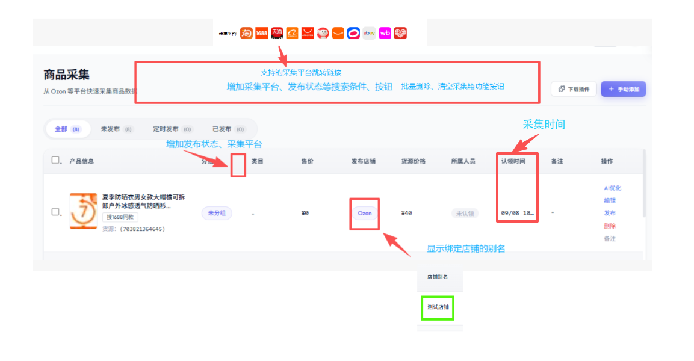
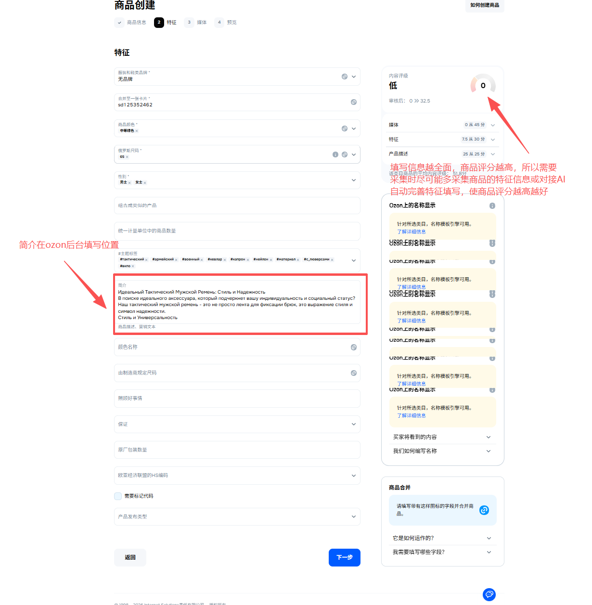
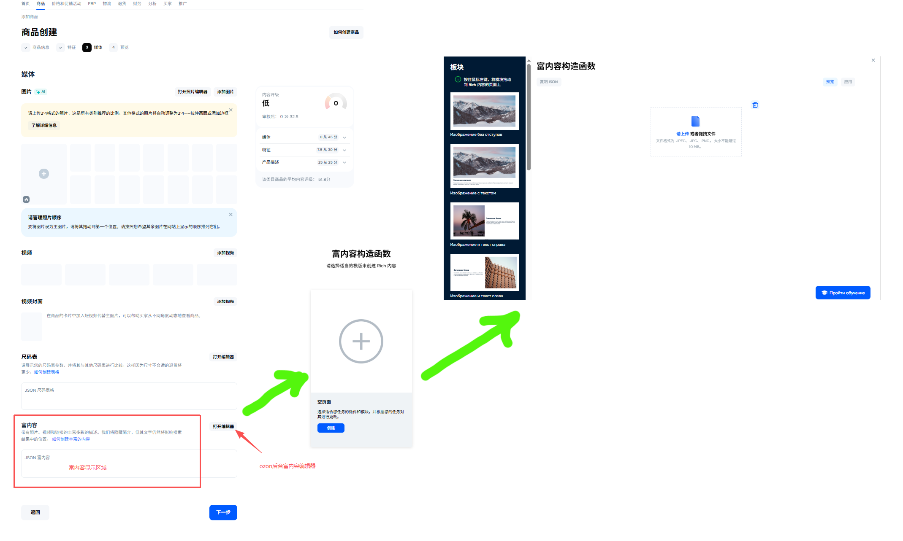
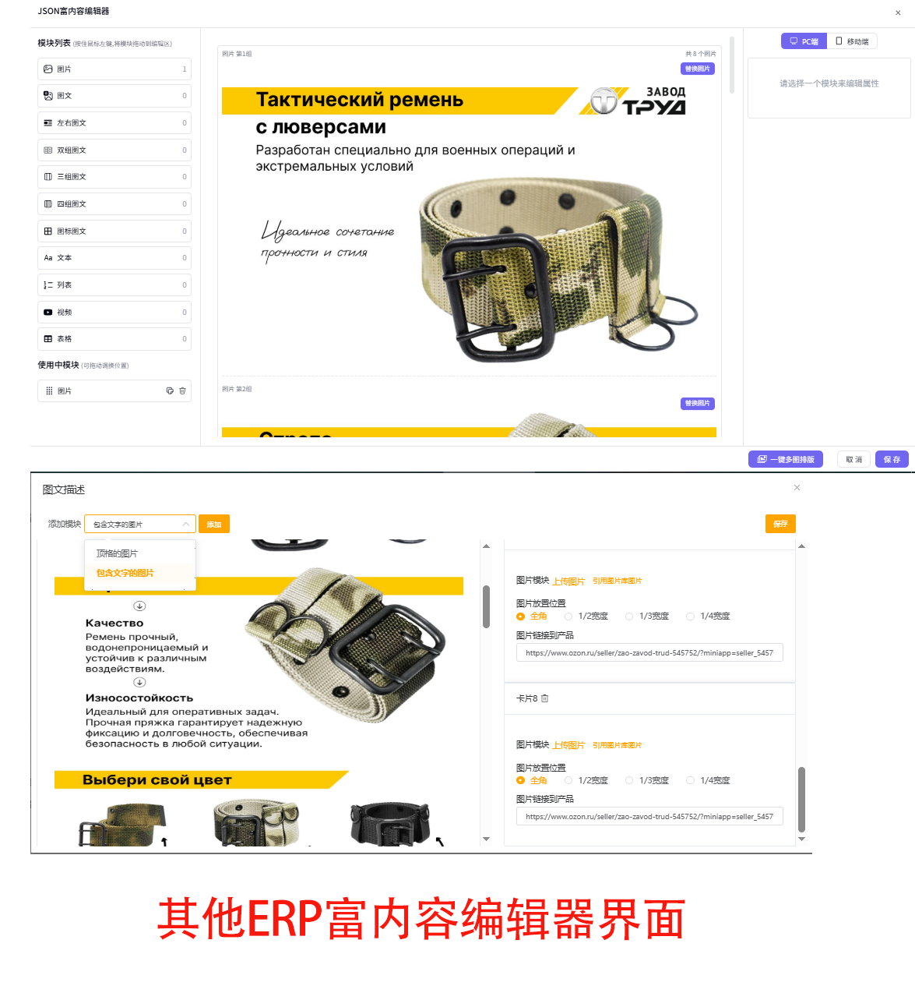
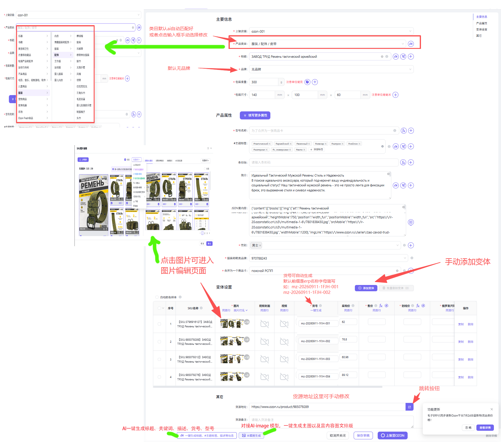

# 欧纵系统开发需求

## 一、首页

*（待补充完善）*

---

## 二、刊登管理

### 2.1 采集箱

- **支持采集平台**：插件采集初步支持 1688、拼多多、淘宝、京东、ozon、Wildberries 等平台（支持原商品跳转链接）。
- **检索功能**：产品信息字段标题保持不变，新增搜索过滤功能：
  - 按商品标题搜索
  - 按采集平台筛选
  - 按发布状态（已发布、未发布）筛选
- **批量操作**：
  - 批量删除
  - 一键清空采集箱
  - *注：删除与清空操作均需弹窗二次确认。*

#### 采集箱列表字段说明

1. **产品信息**：
   - 显示采集产品的首图。
   - **搜 1688 同款**：集成 1688 “以图搜货源”功能，默认直接携带当前产品图片去搜索，点击跳转到 1688 搜索结果页。
   - **货源**：以“平台 + 采集链接”形式展示，点击可直接跳转到源平台商品页。
2. **分组**：系统内部自定义产品标签（例如：汽配、户外等）。
3. **类目**：鼠标悬停（Hover）后显示完整分类路径。目前采集 Ozon 商品可直接显示，其他平台采集后需手动编辑后显示。
4. **售价**：显示对应采集平台的价格和汇率。在编辑时选择店铺后，显示对应的店铺币种。
5. **发布店铺**：编辑修改后显示对应的 Ozon 店铺名称（店铺别名）。
6. **货源价格**：采集国内平台（1688、淘宝等）显示的价格，默认单位为人民币（￥）。
7. **所属人员**：系统子账号功能（后续版本迭代开发）。
8. **认领时间**：显示为采集入库时间。
9. **备注**：支持自定义文本输入。

---

## 三、产品编辑

> **交互优化说明**：原逻辑采集 1688 等平台产品需先选择类目才显示各字段区域，建议优化为**默认直接展示全部字段模块**（基本信息、类目属性、产品图片、产品视频、其他信息、货源链接）。

### （1）基本信息

1. **AI 优化**：修复配置 DeepSeek 后点击产品标题提示“AI优化失败”的问题；修复目前 1688 采集过来的图片非产品图片的问题。
2. **商品简介**：采集国内平台支持抓取文字描述；采集欧纵（Ozon）平台则对接并显示其原简介描述。
3. **富内容（Rich Content / A+页面）**：
   - 修复目前点开报错、无法编辑的问题。
   - 适用于 Ozon 产品编辑里的图文详细描述，类似亚马逊 A+ 页面或 1688 图文详情。
   - 对应 Ozon 后台手动上架商品时填写的简介与富内容（如下图示）。

### （2）类目属性

1. **类目选择**：支持 AI 自动匹配类目，或手动检索修改；支持系统内类目库获取。
2. **商品属性获取与填充**：
   - 采集 Ozon 平台商品通过 Ozon API 接口自动获取属性。
   - 其他平台采集过来没有对应属性的，支持手动填写（按现有属性字段填充即可）。
   - 后续自动化上品功能需支持通过 AI 自动补全缺失属性，以实现高商品评分自动化上架。
3. **销售属性与变体**：
   - 需结合 Ozon 授权店铺接口确认销售属性获取方式。
   - SKU 列表字段和价格输入逻辑保持不变。
   - 平台 SKU 支持自动随机生成，SKU 标题支持单独进行 AI 智能优化。
4. **手动添加变体**：支持手动新增与编辑变体规格信息。

### （3）产品图片

1. **尺寸调整**：点击单张图片小铅笔图标修改尺寸；新增**批量修改图片尺寸**功能。
2. **选择控制**：图片支持单选、全选（显示清晰的勾选框）。
3. **图像与文字处理**：
   - **图片翻译**：对接 AI 图像翻译能力。
   - **抠图换背景**：支持图片一键抠白底、AI 一键替换背景。
   - **批量加水印**：支持批量添加水印，需提前配置水印方案（可参考“毛子”软件的水印管理功能）。

### （4）产品视频

- **支持视频类型**：封面视频、产品描述视频。
- **上传方式**：点击添加按钮，支持从本地视频库选择视频文件上传。

### （5）货源链接

- 包含**备注**、**链接**、**货源价格**三个输入项。
- 当录入货源价格后，同步更新产品列表中的“货源价格”字段。
- 链接支持点击直接跳转至对应源平台的商品详情页。

### （6）翻译

- 对接翻译接口（优先接入可用的免费文本翻译），一键将商品信息快速翻译为俄文。

---

## 四、定价计算器

### 4.1 字段与配置调整

1. **精简字段**：删除“当前汇率”、“体积重系数”字段，只保留“店铺币种”。
2. **基础信息与费用配置**：
   - 基础信息录入维持现状暂不调整。
   - **物流信息配置**：支持配置跨境物流商，需对接 Ozon 平台官方合作物流（如 GUOO、CEL、中通国际、ZTO、Ural 等，可参考“毛子”系统）。
   - **国内运费与代贴单费用**：保留配置项。
   - **其他费用设置**：字段保持不变，开放用户自定义录入。

### 4.2 利润计算公式

以**售价**为基数倒推计算利润，公式如下：

$$
\text{售价} = \frac{\text{采购成本} + \text{运费} + \text{其他费用}}{1 - \text{利润率} - \text{手续费率} - \text{佣金率} - \text{折损率}} \times \text{折扣率}
$$

### 4.3 插件端工具

- 计划在采集插件版本中集成该“利润计算工具”，可参考“毛子”插件的实现方案与交互逻辑。
